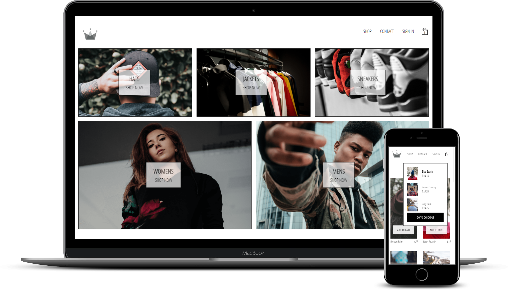

<h1 align="center">
     
 
</h1>

<h2 align="center">
  Crown #013 Store
</h1>

<p align="center">
    
</p>


<p align="center">
  <a href="#-about-the-project">About the project</a>&nbsp;&nbsp;&nbsp;|&nbsp;&nbsp;&nbsp;
  <a href="#-technologies">Technologies</a>&nbsp;&nbsp;&nbsp;|&nbsp;&nbsp;&nbsp;
  <a href="#-getting-started">Getting started</a>&nbsp;&nbsp;&nbsp;|&nbsp;&nbsp;&nbsp;
  <a href="#-how-to-contribute">How to contribute</a>&nbsp;&nbsp;&nbsp;|&nbsp;&nbsp;&nbsp;
  <a href="#-license">License</a>
</p>

## 👨🏻‍💻 About the project

- <p>Crown #013 is an ecommerce project created to improve my skills as React Delevoper and it is part of the final project of the course: 
  
  - [Complete React Developer in 2020(w/Redux, Hooks,GraphQL)](https://www.udemy.com/course/complete-react-developer-zero-to-mastery/)</p>

## 🚀 Technologies

Technologies used in this project:

- [ReactJS](https://reactjs.org/)
- [React Router DOM](https://reacttraining.com/react-router/)
- [Styled Components](https://styled-components.com/)
- [Redux](https://redux.js.org/)
- [Redux-Saga](https://redux-saga.js.org/)
- [Firebase](https://firebase.google.com/)
- [Reselect](https://github.com/reduxjs/reselect#readme)
- [Stripe](https://stripe.com/en-br)


## 💻 Getting started

### Requirements


**Clone the project and access the folder**

```bash
$ git clone https://github.com/KleberLemosVaz/crwn-clothing.git && cd crwn-clothing
```

**Follow the steps below**

```bash
# Install the dependencies
$ yarn

# Start the project
$ yarn start
```


## 📝 License

This project is licensed under the MIT License - see the [LICENSE](LICENSE) file for details.

---

Made with 💜 by Kleber Lemos Vaz